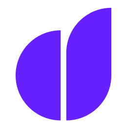
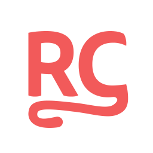

👋 Hi, I'm **Oleksa**

📲 **Speciality:** Software Engineer / iOS Developer  
🌍 **Based in:** Germany  
📫 **Email:** hilltom@protonmail.com  

🛠 **Tech Stack**  
**Language:** Swift  
**Frameworks:** UIKit, SwiftUI  

### Skills

